# Nodejs by Shivendra

## node js introduction 

1. nodejs ek backend hai 
2. V8+ Backend feature = Nodejs
3. V8  C++ me likha gya hai

## What is IDE 
1. IDE = Integrated Development Envionment
eg. Vs code, Cursor AI 


##  What is REPL     
1. REPL = Read Eval print Loop 
2. REPL se ham node terminal  me hi use kar sakte hai 
3. terminal me = node type karke enter kare 
4. jo karna ho kare jaise ki 

```js
D:\Full-Backend>node
Welcome to Node.js v24.3.0.
Type ".help" for more information.
> let a = "Shivendra"
undefined
> a
'Shivendra'
> console.log(a)
Shivendra
undefined
> 8+8
16
```


## DNS

1. DNS = Domain name service
2. Domain Name Entry = jab koye User broswer me search karta hai eg- {www.google.com} to DNS ek IP adress deta hai joki google ka hota hai 

3. DNS Query: isme hota kya hai ki jab search sarte hai to isme se qery jaati hai phir uuse ip adress milt ahia 
4. DNS Server: Ime Ip Store rahta hia 
5. Root DNS : yaha jo hota uska EG- {.com,.org, .ai } isko check karta hai


## What are Protocals
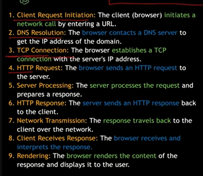


## Node COre Modules


## Requird Keyword
1. isse kya hota hai ki node module se import karta hai 
2. Eg- {const http = require('modul')}


## How to create basics server code
```
const http = require('http');

const server = http.createServer((req,res)=>{
  console.log(req);
});

const PORT = 5000;
server.listen(PORT, ()=>{
  console.log(`server is running at http://localhost:${PORT}`)
})
```


## Node LifeCycle & Event Loop 

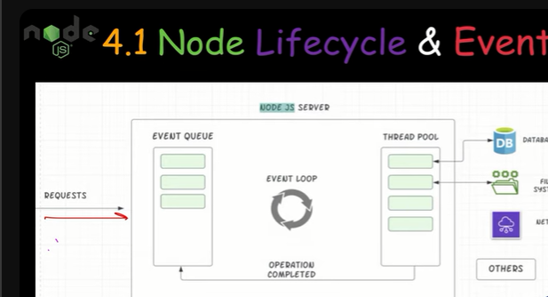


## How to Exit Server 

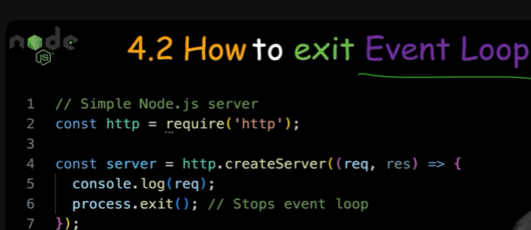

1. Proccess.exit() -- se hota kya hai ki man lo jo fnc chal raha jisme console karna hai request ko to proccess.exit() se ham exit kar skate Note-{isko karne se server ruk jayega console ke baad} 
2. ham ctrl+c se bhi kill kar sakte hai server lekin isko kahi jagha kar skte hai jisse hamra kam hone ke baad server ruk jaye

```
const http = require('http');

const server = http.createServer((req,res)=>{
  console.log(req);
  process.exit();
});

const PORT = 5000;
server.listen(PORT, ()=>{
  console.log(`server is running at http://localhost:${PORT}`)
})
```


## UnderStanding Request Object

```
const http = require('http');

const server = http.createServer((req,res)=>{
  console.log(req.url, req.method, req.headers);
  
});

const PORT = 5000;
server.listen(PORT, ()=>{
  console.log(`server is running at http://localhost:${PORT}`)
})
```

1. url se basiclly hota kya hai ki url ki details ati hai 
2. Method yaha batata hai ki request ki type ki hai jaise ki {GET, POST, etc.}
3.Headrs yaha batata hai {Data type, Browser infor, Token,Authorization}


## Sending Response

1. isme ham koye bhi data bhej satke hai jise ki eg- {  html data, json data    }
 2. step 1st
 ```
res.setHeader("Conttent-Type", "text/html");
 ```
3. step 2nd
```
res.write(`<html>
          <head>
<title>   First html code in node js  </title>
        </head>
        <body>

          <h1>
            Shivendra mauhariya
            </h1>
        </body>
            </html>
          `);
});
```


4.type dena imp hota hai 
5. req.write se likh sakte hai 

```
const http = require("http");

const server = http.createServer((req, res) => {
  res.setHeader("Conttent-Type", "text/html");
  res.write(`<html>
          <head>
<title>   First html code in node js  </title>
        </head>
        <body>

          <h1>
            Shivendra mauhariya
            </h1>
        </body>
            </html>
          `);
          res.end();
});

const PORT = 5000;
server.listen(PORT, () => {
  console.log(`server is running at http://localhost:${PORT}`);
});
```
6. res.end() se ham response rokte hia 


## How to send multiple respone with the help of if,else 
##  Routing

```
const http = require("http");

const server = http.createServer((req, res) => {
  console.log(req.url, req.method, req.headers);

  if (req.url === "/") {
    res.setHeader("Conttent-Type", "text/html");
    res.write(`<html>
          <head>
<title>   First html code in node js  </title>
        </head>
        <body>

          <h1>
           This is a home page
           
            </h1>
            <a href="/about">About</a>
        </body>
            </html>
          `);
  } else if (req.url === "/about") {
    res.setHeader("Conttent-Type", "text/html");
    res.write(`<html>
          <head>
<title>   First html code in node js  </title>
        </head>
        <body>

          <h1>
            Shivendra mauhariya
            
            </h1>
        </body>
            </html>
          `);
    res.end();
  } else {
    res.setHeader("Conttent-Type", "text/html");
    res.write(`<html>
          <head>
<title>   First html code in node js  </title>
        </head>
        <body>

          <h1>
           404 not Found
            </h1>
        </body>
            </html>
          `);
    res.end();
  }
});

const PORT = 5000;
server.listen(PORT, () => {
  console.log(`server is running at http://localhost:${PORT}`);
});
```


## Taking user input

```

  if (req.url === "/") {
    res.setHeader("Conttent-Type", "text/html");
    res.write(`<html>
          <head>
<title>   First html code in node js  </title>
        </head>
        <body>
<form action="/submit" method='POST'>
<h1> Enter your detail </h1>
<input type='text' placeholder='enter your details'>
  <label for="male">Male</label>
<input type="radio" id="male" name="gender" value="male"> <br>
<label for="female">Female</label>
<input type="radio" id="female" name="gender" value="female"> <br>

<button>Submit</button>

</form>
        </body>
            </html>
          `);
    return res.end();
  } else {
    res.setHeader("Conttent-Type", "text/html");
    res.write(`<html>
          <head>
<title>   First html code in node js  </title>
        </head>
        <body>

          <h1>
           404 not Found
            </h1>
        </body>
            </html>
          `);
    res.end();
  }
})
```

## Redirecting a page 

1. 302 ka matalb page ko redircet karna hai
2. location me path de skate hai jaha pe le jana hai  

```
else if(req.url=== '/submit' && req.method == 'POST'){
    fs.writeFileSync('user.txt', 'Shivendra Saket');
    res.statusCode = 302;
    res.setHeader('location', '/')
  }
  ```


# Parsing Request


## Stream 

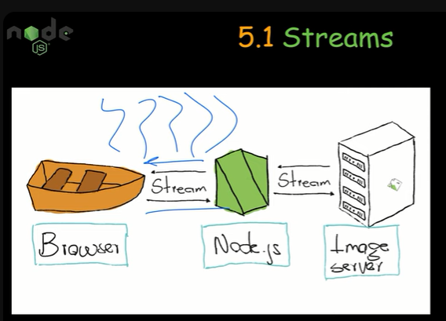

1. stream ka matlb hota hai ki koye data chote chote part me flow ho raha eg- yt me koye video uplaod ho rahi to eksta nhi hoti mb mb hoti ho 


## Chunks

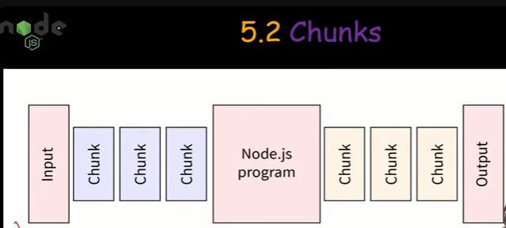

1. chunks me data wahi choote chhote part me ata hai

## Buffers 
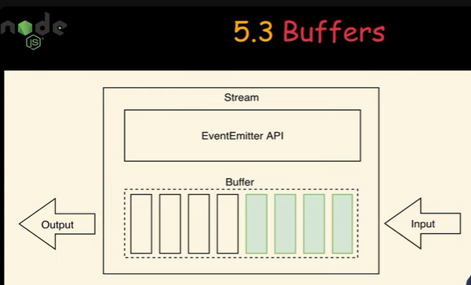

1. buffers me sab chunks ko order me lagata hai line by line squence me phir data ka output deta hai final


## Reading a Buffers

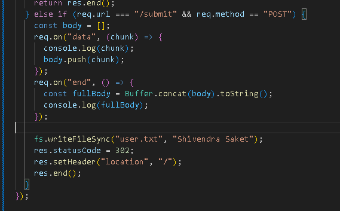

```
 else if (req.url === "/submit" && req.method == "POST") {
    const body = [];
    req.on("data", (chunk) => {
      console.log(chunk);
      body.push(chunk);
    });
    req.on("end", () => {
      const fullBody = Buffer.concat(body).toString();
      console.log(fullBody);
    });
 }
 ```

 1. phele ek arry banye jisme chunks ko store karna hai 
 2.  fnc bana ke usme chunks ko push kare 
 3. chunks complete hone ke bad jo buffer hai inko ek sath jodega
 4. concat se sara data jud raha
 5. tostring se string me ho raha

 ## Parsing Request

 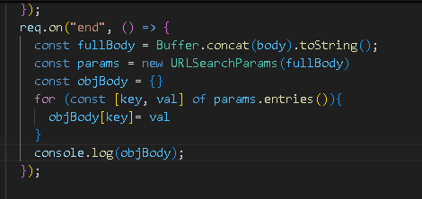

 ```
    req.on("end", () => {
      const fullBody = Buffer.concat(body).toString();
      const params = new URLSearchParams(fullBody)
      // const objBody = {}
      // for (const [key, val] of params.entries()){
      //   objBody[key]= val
      // }
      const  bodyObj = Object.fromEntries(params)
      console.log(bodyObj);
    });
```

1. data ko decode karne ke liye ye method use karte hai 
2. data isse hamar object  me milta hia 
3. key matlab jo input hai


# Import Modules 

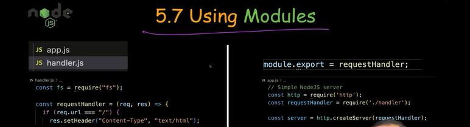

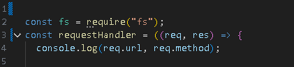
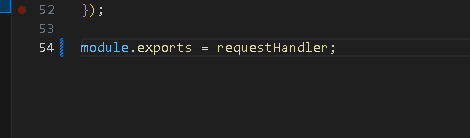

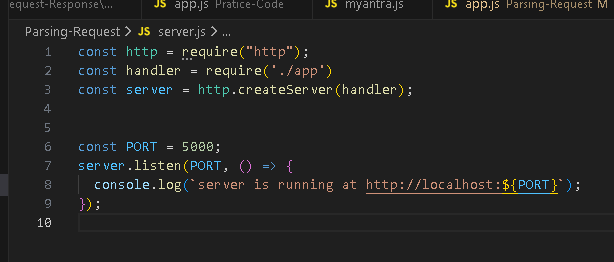

1. jis file  me code hai umse niche module.export = // jist varible me fnc me store ho uska name \
2. jis file me server ka code hai usme require(./path)
3. ab require ko chahe jis varible me save karo use ho jayega creatserver wale mai 
4. ye matter nhi karta ki jist name se export kiye ho usi ko use kare kiyuki export sirf wahi hua hai 


## how to export multiple object


# Event Loop and Async Code

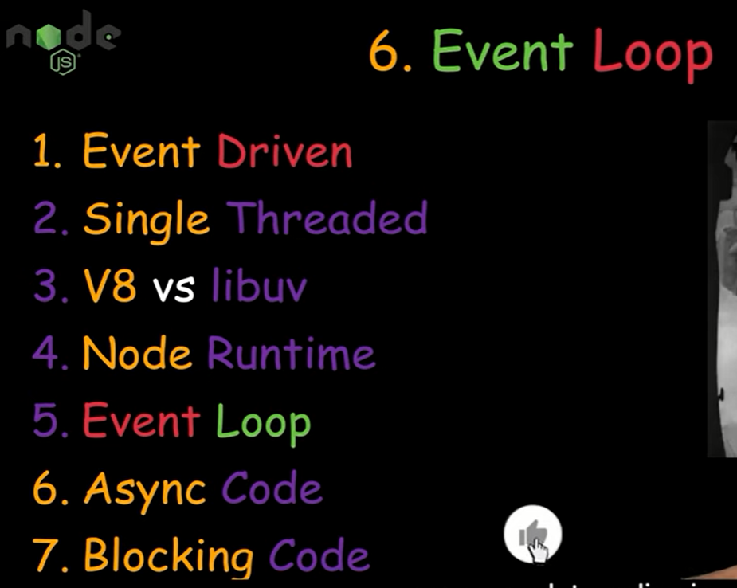


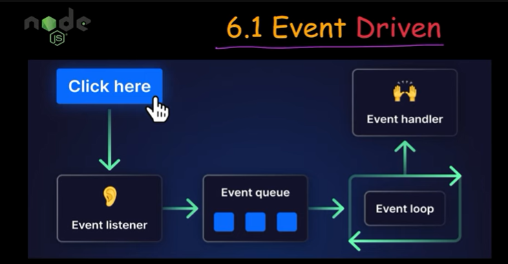


1. Event Loop ek baar  me 1 kaam karta hai baaki sab wait karte hai 


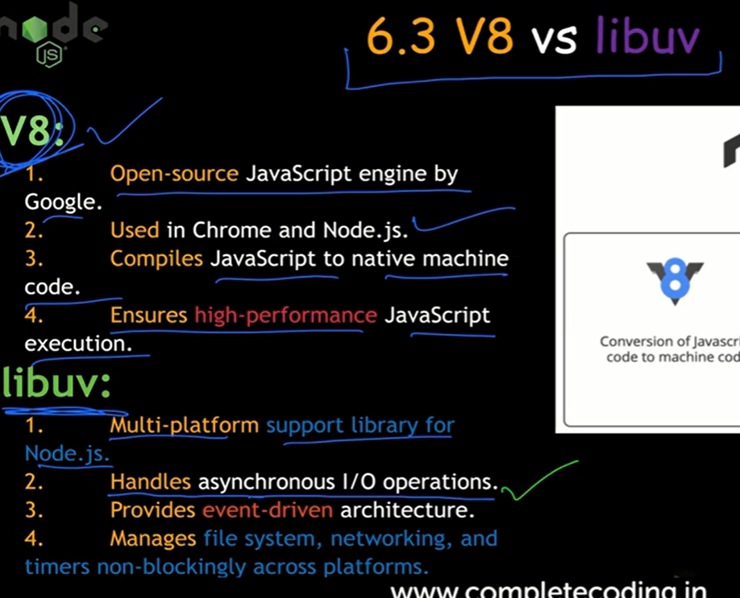


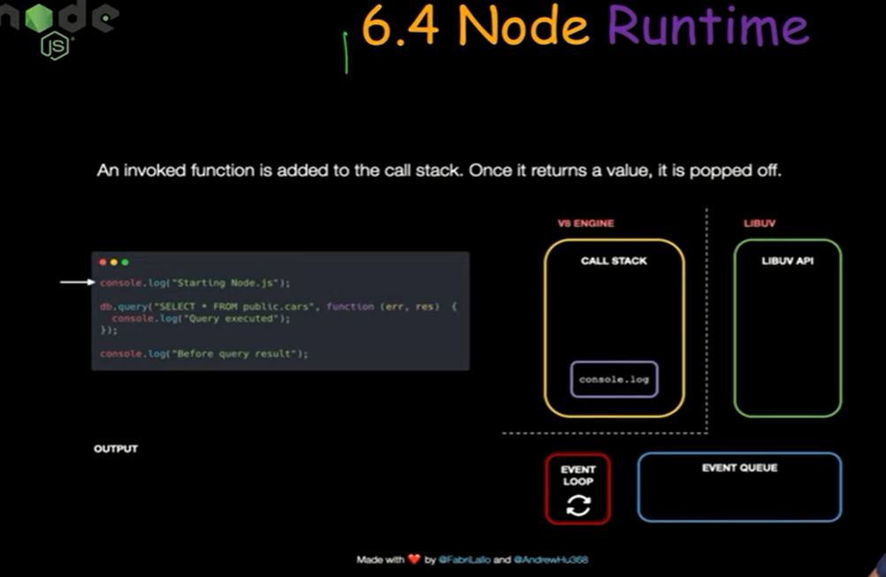


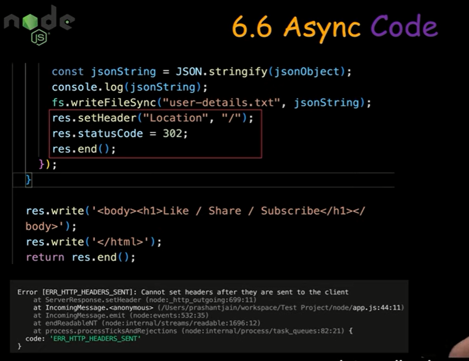


# Erorr and Debugging


## types Of Error

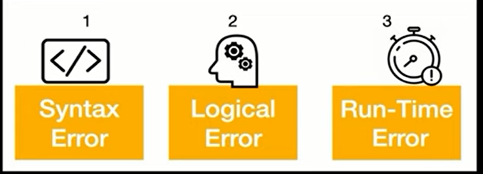

## Logical Error

```
const logic =()=>{

let a = 5;
if(a = 10){
  console.log('10')
}else{
  console.log('no');
  
}


};


module.exports = logic
```


# Express Js

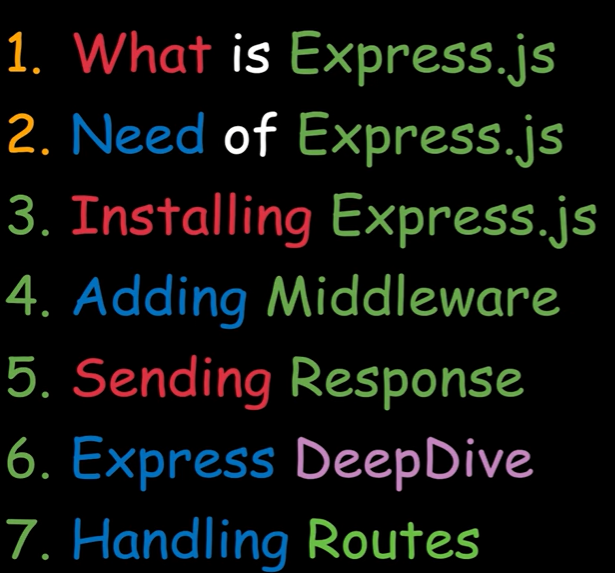

# What Is A Express JS
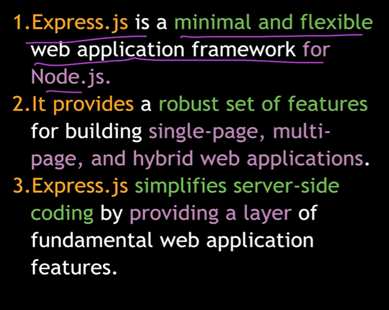

## How to install express

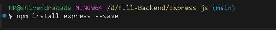

## How to create a server


## How to add middleware

```
const http = require("http");

const express = require('express');

// const handler = require('./app')
const app = express()

app.use((req,res,next)=>{
  console.log( 'hey this is a first middleware', req.url, req.method)
});
app.use((req,res,next)=>{
  console.log( 'hey this is a Second middleware', req.url, req.method)
});


const server = http.createServer(app);


const PORT = 5000;
server.listen(PORT, () => {
  console.log(`server is running at http://localhost:${PORT}`);
});
```

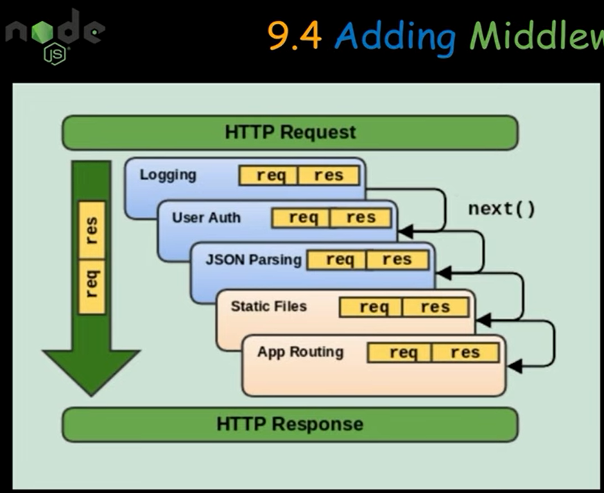


## How TO Send Response 

```
const http = require("http");

const express = require('express');

// const handler = require('./app')
const app = express()

app.use((req,res,next)=>{
  console.log( 'hey this is a first middleware', req.url, req.method)
  next()
});
app.use((req,res,next)=>{
  console.log( 'hey this is a Second middleware', req.url, req.method)
  res.send('<h1>LING ka Happy New Year</h1>')
});


const server = http.createServer(app);


const PORT = 5000;
server.listen(PORT, () => {
  console.log(`server is running at http://localhost:${PORT}`);
});
```

## Express DeepDive

```


const express = require('express');

// const handler = require('./app')
const app = express()

app.use((req,res,next)=>{
  console.log( 'hey this is a first middleware', req.url, req.method)
  next()
});
app.use((req,res,next)=>{
  console.log( 'hey this is a Second middleware', req.url, req.method)
  res.send('<h1>LING ka Happy New Year</h1>')
});


const PORT = 5000;
app.listen(PORT, () => {
  console.log(`server is running at http://localhost:${PORT}`);
});
```


## Handling Route

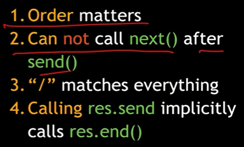

```


const express = require('express');

// const handler = require('./app')
const app = express()

app.use('/', (req,res,next)=>{
  console.log( 'hey this is a first middleware', req.url, req.method)
  

const express = require('express');

// const handler = require('./app')
const app = express()

app.use('/', (req,res,next)=>{
  console.log( 'hey this is a first middleware', req.url, req.method)
   res.send('<h1> Happy New Year 2025</h1>')
  next()
});
app.use('/2026',(req,res,next)=>{
  console.log( 'hey this is a Second middleware', req.url, req.method)
  res.send('<h1> Have a nice day</h1>')
});


const PORT = 5000;
app.listen(PORT, () => {
  console.log(`server is running at http://localhost:${PORT}`);
});

   
  next()
});
app.use('/2026',(req,res,next)=>{
  console.log( 'hey this is a Second middleware', req.url, req.method)
  res.send('<h1> Happy New Year 2026</h1>')
});


const PORT = 5000;
app.listen(PORT, () => {
  console.log(`server is running at http://localhost:${PORT}`);
});
```

## GET And POST Request

```


const express = require('express');

// const handler = require('./app')
const app = express()

app.post('/', (req,res,next)=>{
  console.log( 'hey this is a first middleware', req.url, req.method)
next()

});


app.use('/', (req,res,next)=>{
 
   res.send('<h1> Happy New Year 2025</h1>')
  next()


app.use('/2026',(req,res,next)=>{
  console.log( 'hey this is a Second middleware', req.url, req.method)
  res.send('<h1> Have a nice day</h1>')
  next()
});
app.get('/2026',(req,res,next)=>{
  console.log( 'hey this is a Second middleware', req.url, req.method)
  res.send('<h1> Have a Get request</h1>')
});
```


# Expressjs Deepdive

## BodyParser

```
const express = require('express');
const bodyParser = require('body-parser')
const app = express();

app.use('/',(req,res,next)=>{

console.log('this is a First middleware')
next()

});

// second middleware
app.use('/',(req,res,next)=>{

console.log('this is a Second middleware')

next()
});

// Sending Response
            app.get('/contact-us',(req,res,next)=>{

            console.log('this is third Second middleware')
            res.send(`<html>
                      <head>
            <title>   First html code in node js  </title>
                    </head>
                    <body>
            <form action="/contact-us" method='POST'>
            <h1> Enter your detail </h1>
            <label for="Username">Username</label>
            <input type='text' id= 'Username' name='Username' placeholder='enter your details'>
              <label for="male">Male</label>
            <input type="radio" id="male" name="gender" value="male"> <br>
            <label for="female">Female</label>
            <input type="radio" id="female" name="gender" value="female"> <br>

            <button>Submit</button>

            </form>
                    </body>
                        </html>`)
            ;
            });

              app.use(bodyParser.urlencoded())


app.post('/contact-us',(req,res,next)=>{

console.log('this is Fourth  middleware', req.body)
res.send('this is a Fourth middleware written by shivendra')
;
});


const PORT = 3001;

app.listen(PORT,()=>{

console.log(`server is runnig on http://localhost:${PORT}`)

})
```